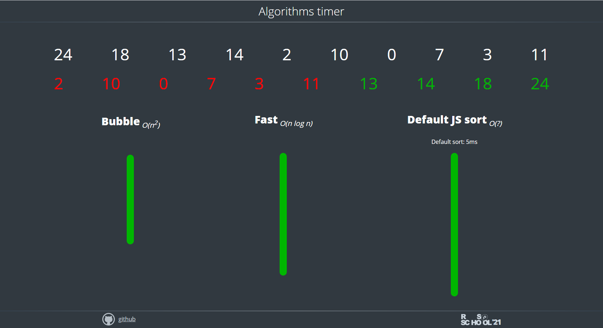

# Алгоритмы/Структуры данных

- [Базовые алгоритмы сортировки и поиска](#Базовые-алгоритмы-сортировки-и-поиска)
- [Базовые структуры данных](#Базовые-структуры-данных)

## Базовые алгоритмы сортировки и поиска

### Big-О или «О» большое

В программировании Big-О показывает, за сколько шагов (тактов процессора) выполняется алгоритм.\
Характеризует быстродействие функции (эффективность конкретного алгоритма).\
Использовать Big-О для оценки сложности алгоритма предложил Дональд Кнут.\
Читаем: О(1) – О от одного, О(n) – О от n.

Чем быстрее возрастает время выполнения функции при увеличении количества элементов, тем менее эффективен алгоритм. Одними из самых часто встречаемых сложностей являются:

- О(1)
- O(log n)
- O(n)
- O(n log n)
- O(n²)
- O(n!)

Их эффективность:


Следующее демо позволяет наглядно сравнить скорость выполнения некоторых алгоритмов сортировки, отличающихся значением Big-О (картинка кликабельна).

[](https://algorithms-timer-demo.netlify.app/)

### Пузырьковая сортировка

- Пробегает набор данных слева направо, сравнивая значения внутри каждой пары и перемещая наименьшее влево.
  Процесс повторяется до тех пор, пока ни одно значение уже не может быть перемещено.
- Алгоритм очень прост в реализации, но малоэффективен
- Эффективность («О» большое):
  - Наилучший вариант: O(n).
  - Средний и худший варианты: O(n²).


**Пузырьковая сортировка**

```js
function bubbleSort(arr) {
  const n = arr.length;
  for (let i = 0; i < n - 1; i++) {
    for (let j = 0; j < n - 1 - i; j++) {
      if (arr[j + 1] < arr[j]) {
        let t = arr[j + 1];
        arr[j + 1] = arr[j];
        arr[j] = t;
      }
    }
  }
  return arr;
}
bubbleSort(arr);
```

### Сортировка слиянием (merge sort)

- Весь набор данных делится минимум на две группы.
  Пары значений сравниваются между собой, наименьшее перемещается влево.
  После сортировки внутри всех пар, сравниваются левые значения двух левых пар. Таким образом, создаётся группа из четырёх значений: два наименьшие — слева, наибольшие — справа.
  Процесс повторяется до тех пор, пока не останется только один набор.
- Это один из фундаментальных алгоритмов сортировки.
- Эффективность («О» большое):
  - Наилучший вариант: O(n).
  - Средний и худший варианты: O(n log n).


### Быстрая сортировка

- Весь набор данных делится пополам путём выбора среднего элемента и перемещения всех, кто меньше него, влево.
  Затем такая же процедура итерационно выполняется с левой частью до тех пор, пока не останутся только два элемента. В результате левая часть окажется отсортированной.
  Затем всё то же самое делается с правой частью.

Хотя «О» большое здесь имеет те же значения (а в ряде случаев — хуже), что и у многих других алгоритмов сортировки, но на практике этот алгоритм зачастую работает быстрее, например, той же сортировки слиянием.
Данные будут последовательно делиться пополам, пока не будут целиком отсортированы.

- Эффективность («О» большое):
  - Наилучший вариант: O(n).
  - Средний вариант: O(n log n).
  - Худший вариант: O(n²).


**Сравнение алгоритмов сортировки слиянием и быстрой сортировки**

Быстрая сортировка на практике зачастую эффективнее.
Сортировка слиянием сразу делит набор данных на наименьшие возможные группы, а затем восстанавливает набор, инкрементально сортируя и укрупняя группы.
Быстрая сортировка последовательно делит набор по среднему значению, пока он не будет отсортирован рекурсивно.

**Быстрая сортировка**

```js
function quickSort(arr) {
  if (arr.length == 0) return [];
  let a = [],
    b = [],
    p = arr[0];

  for (let i = 1; i < arr.length; i++) {
    if (arr[i] < p) a.push(arr[i]);
    else b.push(arr[i]);
  }
  return quickSort(a).concat(p, quickSort(b));
}
quickSort(arr);
```

### Бинарный поиск

[Что такое бинарный поиск](https://youtu.be/9EmO9_MK1gQ?t=34)


**Бинарный поиск**

```js
const arr = [-1, 0, 1, 2, 3, 4, 6, 100, 10000];

function binarySearchIterationMethod(arr, i) {
  let left = 0;
  let right = arr.length - 1;
  let mid;

  while (left <= right) {
    mid = Math.floor((right + left) / 2);

    if (arr[mid] === i) {
      return mid;
    } else if (arr[mid] > i) {
      right = mid - 1;
    } else {
      left = mid + 1;
    }
  }

  return -1;
}

binarySearchIterationMethod(arr, 100); // 7

function binarySearchRecursiveMethod(arr, i, left = 0, right = arr.length - 1) {
  if (left > right) return -1;
  else {
    let mid = Math.floor((right + left) / 2);
    if (arr[mid] === i) {
      return mid;
    } else if (arr[mid] > i) {
      return binarySearchRecursiveMethod(arr, i, left, mid - 1);
    } else {
      return binarySearchRecursiveMethod(arr, i, mid + 1, right);
    }
  }
}

binarySearchRecursiveMethod(arr, 5); // -1
```

## Базовые структуры данных

- массив
- список
- стек
- очередь
- хэш таблица
- двоичное дерево

### Массив

- Упорядоченный набор элементов, к каждому из которых можно обратиться по его индексу (порядковому номеру в массиве).
- Оптимален для индексирования (получения элемента массива через его номер).
- Плох для поиска, вставки и удаления, если не делать этого в самом конце массива.
- Эффективность («О» большое):
  - Индексирование: O(1).
  - Поиск: O(n).
  - Двоичный поиск: O(log n).
  - Вставка: недопустимо (если не делать этого в самом конце массива).


### Список (связный список)

- Данные хранятся в узлах, указывающих на другие узлы. По итогу список выглядит, как вложенные друг в друга объекты.
- У каждого узла есть value (значение этого элемента(узла)) и nextNode (ссылка на следующий элемент связного списка).
- Оптимален для вставки и удаления (т.к. надо просто "перекинуть" указатель с определенного элемента на следующий).
- Плох для индексирования и поиска (сложно получить элемент по его номеру или просто найти элемент из-за вложенности).

###### Дополнительно:

- Существует двусвязный список: он имеет помимо nextNode и value ещё и previousNode (значение узла, ссылка на следующий узел и на предыдущий соответственно).


### Стек

- Обычно реализуется с помощью связного списка, может быть создан и из массива
- Стеки — это LIFO-структуры данных (last in, first out).
- Аналог стека — стопка тарелок: последнюю добавленную в стопку тарелку возьмут первой.
- Голова – единственное место для вставки и удаления элементов.


### Очереди

- Как и стек очереди могут быть реализованы с помощью связного списка или массива.
- Очереди — это FIFO-структуры данных (first in, first out).
- Аналог очереди - очередь в магазине: первого покупателя обслужат первым
- Элементы удаляются из головы, а добавляются в хвост.

- Эффективность списка, стека, очереди («О» большое):
  - Индексирование: O(n).
  - Поиск: O(n).
  - Двоичный поиск: O(n).
  - Вставка: O(1).


### Хэш-таблица (объект)

- Данные хранятся в виде пар ключ-значение.
- Оптимальны для поиска, вставки и удаления.
- Эффективность («О» большое):
  - Индексирование: O(1).
  - Поиск: O(1).
  - Вставка: O(1).


### Двоичное дерево

- Двоичное дерево — это такая структура данных, в которой каждый узел имеет максимум два дочерних элемента. Дочерние элементы бывают левым и правым. Деревья разработаны для оптимизирования списка и сортировки. Используются для создания двоичных деревьев поиска.


#### Двоичное дерево поиска

Двоичное дерево с помощью сравнивания ключей решает, в каком направлении следовать к дочернему узлу.

- Ключ левого дочернего узла меньше, чем у родительского.
- Ключ правого дочернего узла больше, чем у родительского.
- Не может быть дублирующих узлов.
- Оптимальны для сортировки и поиска.

- Эффективность («О» большое):
  - Индексирование: двоичное дерево поиска — O(log n).
  - Поиск: двоичное дерево поиска — O(log n).
  - Вставка: двоичное дерево поиска — O(log n).


#### Что можно сделать до старта курса

- решать задачи на сайте [Codewars](https://www.codewars.com/), определять значение Big O используемых вами алгоритмов

#### Вебинары RS School

- [Data Structures with JS](https://youtu.be/j6w_ZJSYNRU)

#### Дополнительные материалы

- [Шпаргалка для технического собеседования](https://habr.com/ru/company/mailru/blog/350326/)
- [Алгоритмы сортировки в танцах](https://www.youtube.com/user/AlgoRythmics/videos)
- [Оценка сложности алгоритма. Сложность алгоритмов. Big O](https://youtu.be/ZRdOb4yR0kk)
- [CS50 (Computer Science 50)](https://ru.wikipedia.org/wiki/CS50)
